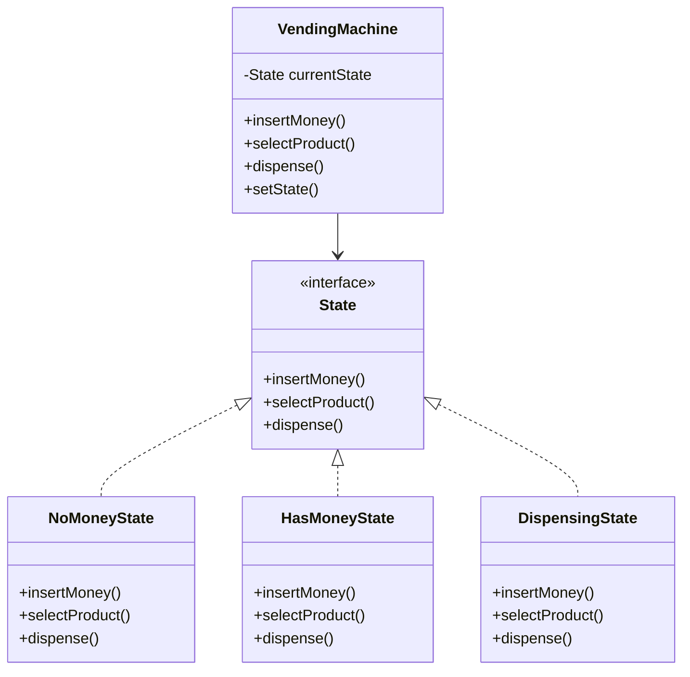

# State Design Pattern

## What problem does the State pattern solve?
The State pattern solves the problem of managing an object's behavior when its internal state changes. Instead of having multiple if-else conditions to handle different states, it allows an object to alter its behavior when its internal state changes. The object will appear to change its class.

## A simple real world example of that pattern in action
Think of a vending machine:
- When it has no money, it can only accept coins
- When it has money, it can dispense items or return money
- When dispensing, it needs to complete the operation before accepting new requests

## Use Case
- When an object needs to change its behavior based on its internal state
- When you have a lot of conditional statements that depend on the object's state
- When you want to avoid large state-specific conditional statements in your code

## Key Characteristics
1. **Encapsulated State Logic**: Each state is represented by a separate class
2. **Clean Transitions**: State changes are handled cleanly through dedicated classes
3. **Single Responsibility**: Each state class handles only the behavior for that specific state
4. **Easy to Add States**: New states can be added by creating new classes without modifying existing code

## Class Diagram
