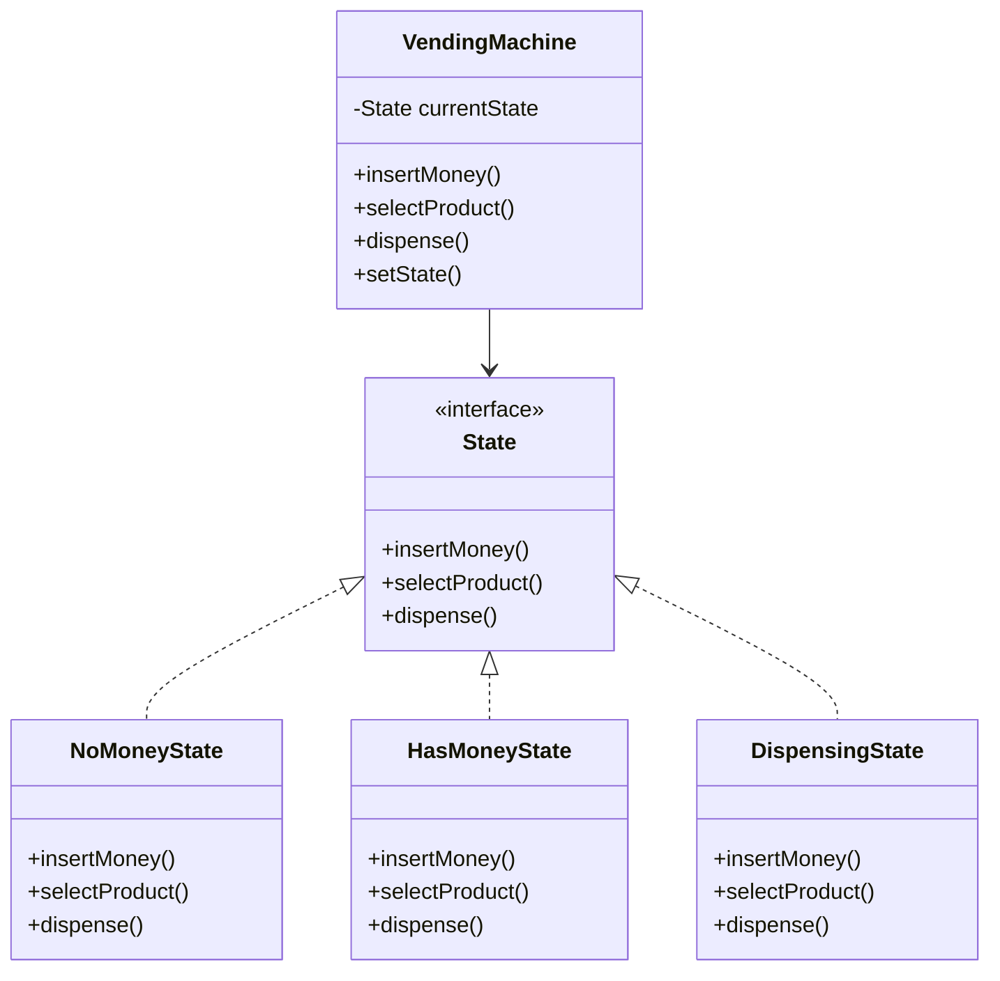

# State Design Pattern

## What problem does the State pattern solve?
The State pattern solves the problem of managing an object's behavior when its internal state changes. Instead of having multiple if-else conditions to handle different states, it allows an object to alter its behavior when its internal state changes. The object will appear to change its class.

## A simple real world example of that pattern in action
Think of a vending machine:
- When it has no money, it can only accept coins
- When it has money, it can dispense items or return money
- When dispensing, it needs to complete the operation before accepting new requests

## Use Case
- When an object needs to change its behavior based on its internal state
- When you have a lot of conditional statements that depend on the object's state
- When you want to avoid large state-specific conditional statements in your code

## Key Characteristics
1. **Encapsulated State Logic**: Each state is represented by a separate class
2. **Clean Transitions**: State changes are handled cleanly through dedicated classes
3. **Single Responsibility**: Each state class handles only the behavior for that specific state
4. **Easy to Add States**: New states can be added by creating new classes without modifying existing code

## Class Diagram


## Step-by-Step Code Explanation

Let's break down the implementation of our Vending Machine state pattern:

### 1. The State Interface
```java
public interface State {
    void insertMoney();
    void selectProduct();
    void dispense();
}
```
Key points:
- Defines the contract for all states
- Each method represents a possible action
- All states must implement these methods

### 2. The Concrete States

#### NoMoneyState
```java
public class NoMoneyState implements State {
    private VendingMachine vendingMachine;

    public NoMoneyState(VendingMachine vendingMachine) {
        this.vendingMachine = vendingMachine;
    }

    @Override
    public void insertMoney() {
        System.out.println("Money accepted!");
        vendingMachine.setState(new HasMoneyState(vendingMachine));
    }

    @Override
    public void selectProduct() {
        System.out.println("Please insert money first");
    }

    @Override
    public void dispense() {
        System.out.println("Please insert money first");
    }
}
```
Key points:
- Holds reference to context (VendingMachine)
- Only insertMoney() leads to state change
- Other actions are invalid in this state

#### HasMoneyState
```java
public class HasMoneyState implements State {
    private VendingMachine vendingMachine;

    public HasMoneyState(VendingMachine vendingMachine) {
        this.vendingMachine = vendingMachine;
    }

    @Override
    public void insertMoney() {
        System.out.println("Money already inserted");
    }

    @Override
    public void selectProduct() {
        System.out.println("Product selected");
        vendingMachine.setState(new DispensingState(vendingMachine));
    }

    @Override
    public void dispense() {
        System.out.println("Please select a product first");
    }
}
```
Key points:
- Cannot insert more money
- selectProduct() triggers transition to DispensingState
- dispense() not allowed until product selected

#### DispensingState
```java
public class DispensingState implements State {
    private VendingMachine vendingMachine;

    public DispensingState(VendingMachine vendingMachine) {
        this.vendingMachine = vendingMachine;
    }

    @Override
    public void insertMoney() {
        System.out.println("Please wait, dispensing product");
    }

    @Override
    public void selectProduct() {
        System.out.println("Please wait, dispensing product");
    }

    @Override
    public void dispense() {
        System.out.println("Dispensing product...");
        vendingMachine.setState(new NoMoneyState(vendingMachine));
    }
}
```
Key points:
- All other actions blocked during dispensing
- After dispensing, returns to NoMoneyState
- Completes the state cycle

### 3. The Context Class (VendingMachine.java)
```java
public class VendingMachine {
    private State currentState;

    public VendingMachine() {
        // Start with no money state
        currentState = new NoMoneyState(this);
    }

    public void setState(State state) {
        this.currentState = state;
    }

    // Delegate all actions to current state
    public void insertMoney() {
        currentState.insertMoney();
    }

    public void selectProduct() {
        currentState.selectProduct();
    }

    public void dispense() {
        currentState.dispense();
    }
}
```
Key points:
- Maintains reference to current state
- Delegates all actions to current state
- Provides method to change states
- Starts in NoMoneyState

### 4. Using the State Pattern (StateMain.java)
```java
public class StateMain {
    public static void main(String[] args) {
        VendingMachine vendingMachine = new VendingMachine();

        // Try operations in NoMoneyState
        vendingMachine.selectProduct();  // Error: Please insert money first
        
        // Insert money - transitions to HasMoneyState
        vendingMachine.insertMoney();    // Money accepted!
        
        // Try inserting money again
        vendingMachine.insertMoney();    // Money already inserted
        
        // Select product - transitions to DispensingState
        vendingMachine.selectProduct();  // Product selected
        
        // Complete transaction - returns to NoMoneyState
        vendingMachine.dispense();       // Dispensing product...
    }
}
```

Output:
```
Please insert money first
Money accepted!
Money already inserted
Product selected
Dispensing product...
```

Key points:
- State transitions happen automatically
- Each state handles invalid operations appropriately
- Client code is simple and clean

### Benefits of This Implementation
1. **Single Responsibility**: Each state class handles only its specific behavior
2. **Open/Closed Principle**: New states can be added without changing existing code
3. **Elimination of Complex Conditionals**: No if/else or switch statements needed
4. **Clear State Transitions**: Each state knows its valid next states
5. **Self-Contained States**: State-specific behavior is encapsulated in state classes

### Best Practices
1. Keep state transitions clear and well-documented
2. Use meaningful state names that reflect their purpose
3. Consider using enum for state types if states are fixed
4. Make state classes package-private if they shouldn't be used outside
5. Consider using a state factory if state creation is complex