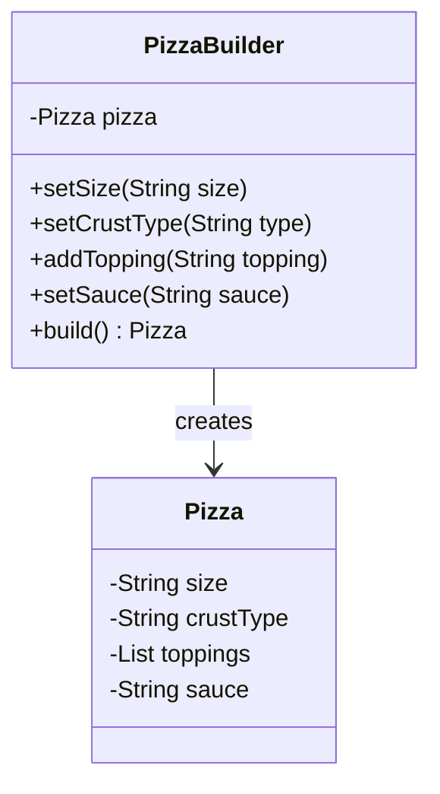

# Builder Pattern

## What problem does the Builder pattern solve?
The Builder pattern solves the problem of constructing complex objects step by step. Imagine you're ordering a pizza - you don't create the whole pizza at once. Instead, you choose the size, then the crust type, then toppings, and so on. The Builder pattern helps when:
- An object needs to be created with lots of optional parameters
- The construction process must allow different representations of the same object
- You want to prevent "telescoping constructors" (constructors with many parameters)

## A simple real-world example of that pattern in action
Think about ordering a pizza at a restaurant:
1. You start with a basic pizza
2. Choose the size (small, medium, large)
3. Select the crust type (thin, thick, stuffed)
4. Add toppings (cheese, pepperoni, mushrooms, etc.)
5. Choose the sauce type (tomato, BBQ, etc.)

Instead of having one huge constructor with all these parameters, the Builder pattern lets you construct the pizza step by step, making the code cleaner and more flexible.

## Use Case
In our code example, we'll implement a Pizza builder that demonstrates how to create different types of pizzas without complicated constructors. Here's how it works:



## Key Characteristics
1. **Step-by-Step Construction**: The builder pattern allows you to construct complex objects step by step.
2. **Fluent Interface**: Often implements method chaining (e.g., `builder.setSize().setCrust().addTopping()`)
3. **Immutable Objects**: Can be used to build immutable objects safely
4. **Clear Separation**: Separates the construction of an object from its representation
5. **Flexible Construction**: Different builders can create different representations using the same construction process

## Benefits
- Avoids constructor pollution
- More readable code through method chaining
- More control over the construction process
- Allows for fine-tuned object creation
- Makes complex object construction simple and maintainable

## Step-by-Step Code Explanation

Let's break down the implementation of our Pizza Builder pattern:

### 1. The Product Class (Pizza.java)
First, we create the Pizza class that represents what we're building:

```java
public class Pizza {
    private String size;
    private String crustType;
    private List<String> toppings;
    private String sauce;

    Pizza() {  // Package-private constructor
        this.toppings = new ArrayList<>();
    }
    // Setter methods are package-private to only allow
    // the builder to modify the pizza
    void setSize(String size) { 
        this.size = size;
    }
    // ... other setters ...
}
```
Key points:
- Constructor is package-private (not public) so only the builder can create Pizza instances
- All setter methods are package-private for encapsulation
- We initialize the toppings list in the constructor

### 2. The Builder Class (PizzaBuilder.java)
Next, we create the PizzaBuilder that constructs our Pizza:

```java
public class PizzaBuilder {
    private Pizza pizza;

    public PizzaBuilder() {
        pizza = new Pizza();  // Create fresh pizza instance
    }

    public PizzaBuilder setSize(String size) {
        pizza.setSize(size);
        return this;  // Return this for method chaining
    }
    // ... other builder methods ...

    public Pizza build() {
        return pizza;  // Return the constructed pizza
    }
}
```
Key points:
- Each setter method returns 'this' to enable method chaining
- The build() method returns the final Pizza object
- The builder maintains a reference to the Pizza being constructed

### 3. Using the Builder (BuilderMain.java)
Here's how to use the builder pattern to create pizzas:

```java
// Create a custom pizza with method chaining
Pizza customPizza = new PizzaBuilder()
        .setSize("large")
        .setCrustType("thin")
        .setSauce("tomato")
        .addTopping("cheese")
        .addTopping("pepperoni")
        .build();

// Create a different pizza with different attributes
Pizza vegetarianPizza = new PizzaBuilder()
        .setSize("medium")
        .setCrustType("thick")
        .setSauce("pesto")
        .addTopping("cheese")
        .addTopping("tomatoes")
        .addTopping("olives")
        .build();
```
Key points:
- Method chaining makes the code readable and fluent
- We can create different pizza configurations easily
- The order of setting attributes doesn't matter
- Each pizza is built independently

### Why This Pattern Is Better
Without the builder pattern, we would need either:
1. A constructor with many parameters:
```java
// Hard to read and error-prone!
Pizza pizza = new Pizza("large", "thin", "tomato", 
                       Arrays.asList("cheese", "pepperoni"));
```

2. Or multiple setter calls:
```java
// Verbose and object might be in invalid state between calls
Pizza pizza = new Pizza();
pizza.setSize("large");
pizza.setCrustType("thin");
pizza.setSauce("tomato");
pizza.addTopping("cheese");
```

The Builder pattern solves these issues by:
- Making the code more readable
- Ensuring the object is fully constructed before use
- Allowing step-by-step construction
- Preventing invalid intermediate states