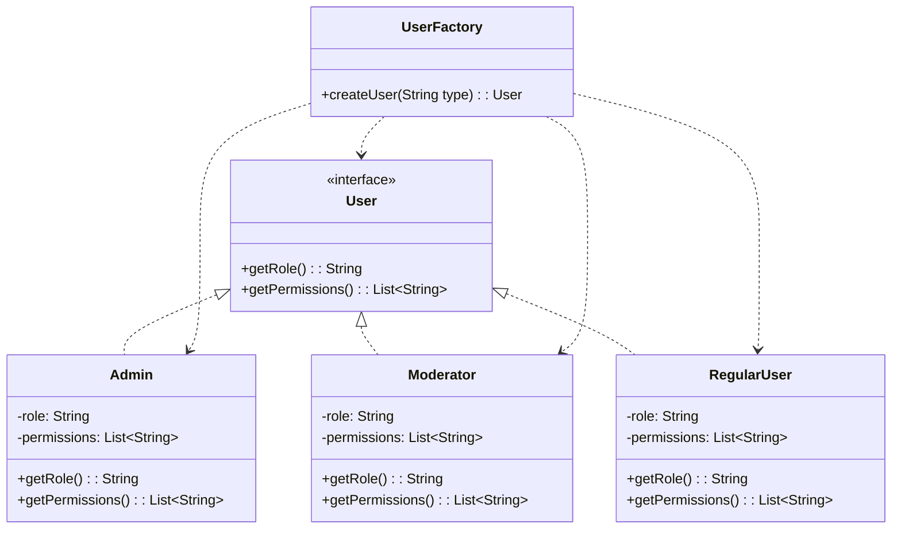

# Factory Pattern

## What problem does the Factory Pattern solve?
The Factory Pattern solves the problem of creating objects without explicitly specifying their exact classes. It provides a way to delegate the responsibility of object creation to a separate factory class, making the code more flexible and easier to maintain.

## Simple Real World Example
Think of a Restaurant kitchen. When a customer orders food (like a burger or pizza), they don't need to know how to make it. They just tell the waiter, and the kitchen (factory) creates the right food item based on the order.

## Use Case
In our example, we have a user management system where different types of users (Admin, Moderator, Regular User) need to be created. Instead of creating these users directly, we use a UserFactory that handles the creation of the appropriate user type based on the request.

## Key Characteristics
- Creates objects without exposing the creation logic
- Refers to the newly created object using a common interface
- Decouples the client code from the object creation code
- Makes adding new types of objects easier without changing existing code

## Class Diagram


## Step-by-Step Code Explanation

Let's break down how the Factory pattern is implemented in our user management system:

### 1. The Base Interface (User.java)
First, we define the common interface that all user types will implement:

```java
public interface User {
    String getRole();
    List<String> getPermissions();
}
```
Key points:
- Simple interface that defines the contract for all user types
- Each user type must provide their role and permissions
- Makes it easy to add new user types later

### 2. Concrete User Classes
We implement different types of users. Here's an example with the Admin class:

```java
public class Admin implements User {
    private String role = "ADMIN";
    private List<String> permissions;

    public Admin() {
        this.permissions = Arrays.asList(
            "CREATE_USER",
            "DELETE_USER",
            "EDIT_SETTINGS",
            "VIEW_ANALYTICS"
        );
    }

    @Override
    public String getRole() {
        return role;
    }

    @Override
    public List<String> getPermissions() {
        return permissions;
    }
}
```
Key points:
- Each user type implements the User interface
- Specific permissions and roles are encapsulated within each class
- Similar implementation for Moderator and RegularUser classes

### 3. The Factory Class (UserFactory.java)
The factory class handles the object creation logic:

```java
public class UserFactory {
    public User createUser(String userType) {
        if (userType == null || userType.isEmpty()) {
            return null;
        }
        
        switch (userType.toLowerCase()) {
            case "admin":
                return new Admin();
            case "moderator":
                return new Moderator();
            case "regular":
                return new RegularUser();
            default:
                throw new IllegalArgumentException("Unknown user type: " + userType);
        }
    }
}
```
Key points:
- Single method to create any type of user
- Creation logic is centralized in one place
- Easy to add new user types by adding new cases
- Returns the base User interface type

### 4. Using the Factory (FactoryMain.java)
Here's how to use the factory to create different types of users:

```java
public class FactoryMain {
    public static void main(String[] args) {
        UserFactory factory = new UserFactory();
        
        // Create different types of users
        User admin = factory.createUser("admin");
        User moderator = factory.createUser("moderator");
        User regular = factory.createUser("regular");
        
        // Use the users polymorphically
        System.out.println("Admin permissions: " + admin.getPermissions());
        System.out.println("Moderator role: " + moderator.getRole());
        System.out.println("Regular user permissions: " + regular.getPermissions());
    }
}
```
Key points:
- Client code only needs to know about the UserFactory and User interface
- No direct instantiation of concrete classes
- Easy to switch between different user types
- Polymorphic behavior through the User interface

### Benefits of This Implementation
1. **Encapsulation**:
   - Client code doesn't know about concrete user classes
   - Creation logic is hidden in the factory

2. **Flexibility**:
   - Easy to add new user types without changing client code
   - Can change user implementations without affecting other code

3. **Maintenance**:
   - Single place to handle object creation
   - Consistent way to create all user types

4. **Testing**:
   - Easy to mock the factory for testing
   - Can swap implementations for different test scenarios