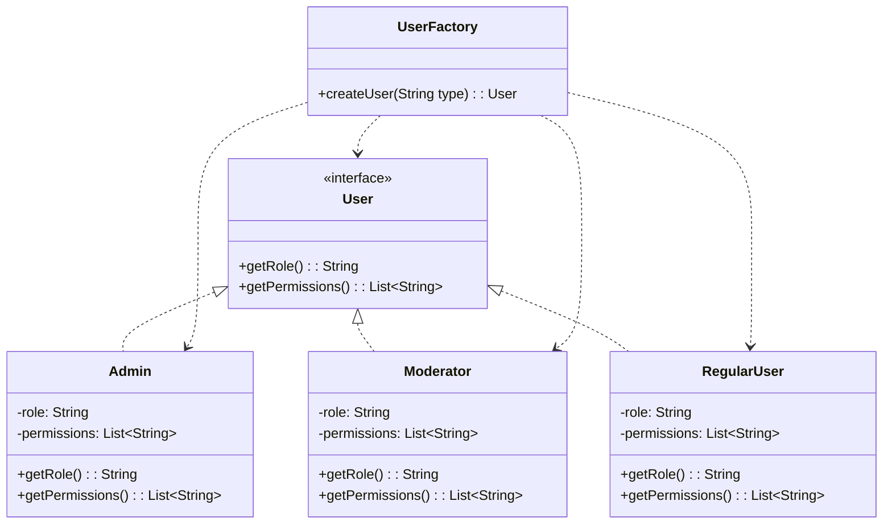

# Factory Pattern

## What problem does the Factory Pattern solve?
The Factory Pattern solves the problem of creating objects without explicitly specifying their exact classes. It provides a way to delegate the responsibility of object creation to a separate factory class, making the code more flexible and easier to maintain.

## Simple Real World Example
Think of a Restaurant kitchen. When a customer orders food (like a burger or pizza), they don't need to know how to make it. They just tell the waiter, and the kitchen (factory) creates the right food item based on the order.

## Use Case
In our example, we have a user management system where different types of users (Admin, Moderator, Regular User) need to be created. Instead of creating these users directly, we use a UserFactory that handles the creation of the appropriate user type based on the request.

## Key Characteristics
- Creates objects without exposing the creation logic
- Refers to the newly created object using a common interface
- Decouples the client code from the object creation code
- Makes adding new types of objects easier without changing existing code

## Class Diagram
