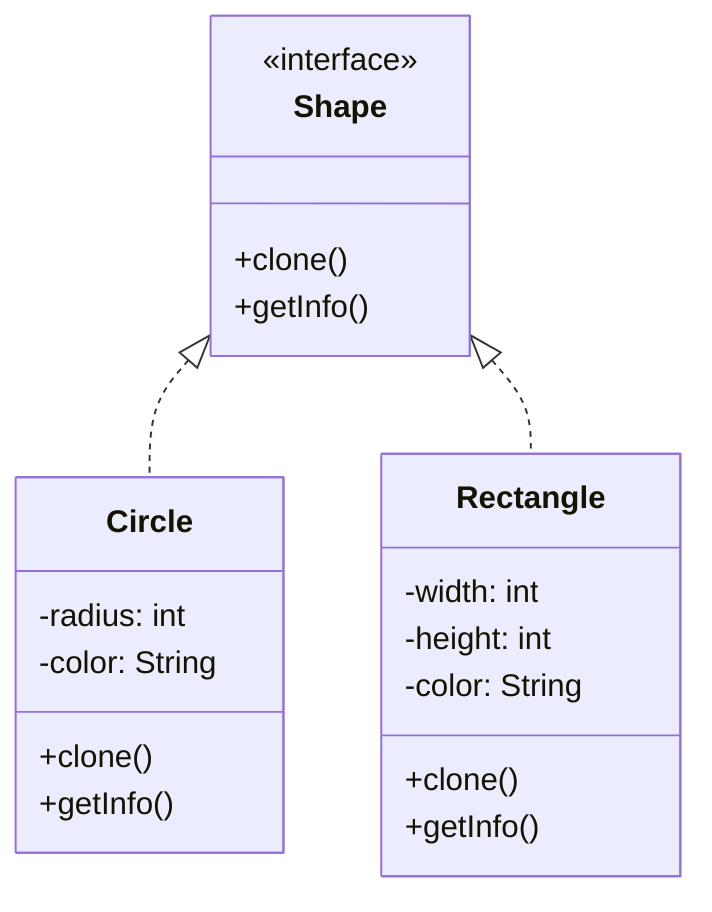
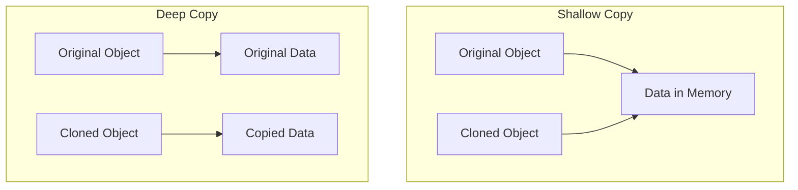

# Prototype Design Pattern

## What problem does that design pattern solve?
The Prototype pattern solves the problem of creating new objects when the creation is costly or complex. Instead of creating a new object from scratch, it creates a copy of an existing object (prototype). This is particularly useful when:
- The cost of creating a new object is expensive
- You need to create objects that are similar to existing objects
- You want to reduce the number of classes needed for object creation

## A simple real world example
Think of a copy machine in an office. Instead of writing a document from scratch every time, you can make copies of an existing document. The original document acts as a prototype, and the copy machine creates clones of it.

## Use Case
Imagine you're creating a drawing application where users can create different shapes. Instead of creating each shape from scratch with all its properties (color, border style, position), you can create prototype shapes and clone them when needed.

## Key Characteristics
1. **Cloning**: Objects can create copies of themselves
2. **Common Interface**: All prototype classes implement the same interface
3. **Shallow vs Deep Copy**: Implementation can support either shallow or deep copying
4. **Registry (Optional)**: Can maintain a registry of available prototypes

## Implementation Diagram



In this implementation, we'll create a simple shape cloning system where different shapes can be cloned instead of creating new instances from scratch.

## Step-by-Step Code Explanation 📝

### 1. The Shape Interface
```java
public interface Shape {
    Shape clone();
    String getInfo();
}
```
- `clone()`: This method is the core of the Prototype pattern. It creates and returns a copy of the current object.
- `getInfo()`: A helper method to display information about the shape.

### 2. The Circle Class
```java
public class Circle implements Shape {
    private int radius;
    private String color;

    public Circle(int radius, String color) {
        this.radius = radius;
        this.color = color;
    }

    @Override
    public Shape clone() {
        return new Circle(this.radius, this.color);
    }

    @Override
    public String getInfo() {
        return "Circle [radius=" + radius + ", color=" + color + "]";
    }
}
```
Key points:
- The class has two properties: `radius` and `color`
- The constructor initializes these properties
- `clone()` creates a new Circle with the same properties
- `getInfo()` returns a string representation of the Circle

### 3. The Rectangle Class
```java
public class Rectangle implements Shape {
    private int width;
    private int height;
    private String color;

    public Rectangle(int width, int height, String color) {
        this.width = width;
        this.height = height;
        this.color = color;
    }

    @Override
    public Shape clone() {
        return new Rectangle(this.width, this.height, this.color);
    }

    @Override
    public String getInfo() {
        return "Rectangle [width=" + width + ", height=" + height + ", color=" + color + "]";
    }
}
```
Key points:
- Has three properties: `width`, `height`, and `color`
- Constructor initializes all properties
- `clone()` creates a new Rectangle with the same properties
- `getInfo()` returns a string representation of the Rectangle

### 4. Usage Example (PrototypeMain)
```java
public class PrototypeMain {
    public static void main(String[] args) {
        // Create original shapes
        Circle originalCircle = new Circle(10, "Red");
        Rectangle originalRectangle = new Rectangle(20, 30, "Blue");

        // Clone the shapes
        Shape clonedCircle = originalCircle.clone();
        Shape clonedRectangle = originalRectangle.clone();

        // Print information about original and cloned shapes
        System.out.println("Original shapes:");
        System.out.println(originalCircle.getInfo());
        System.out.println(originalRectangle.getInfo());

        System.out.println("\nCloned shapes:");
        System.out.println(clonedCircle.getInfo());
        System.out.println(clonedRectangle.getInfo());
    }
}
```
Key points:
1. First, we create original shapes (Circle and Rectangle) with specific properties
2. We then clone these shapes using the `clone()` method
3. Finally, we print both original and cloned shapes to verify they are identical

### Flow of the Program:
1. User creates original shapes with specific properties
2. When clone() is called on a shape:
   - A new object of the same type is created
   - All properties are copied from the original to the new object
3. The cloned object is a completely separate instance but with identical properties
4. Both original and cloned objects can be used independently

### Output Example:
```
Original shapes:
Circle [radius=10, color=Red]
Rectangle [width=20, height=30, color=Blue]

Cloned shapes:
Circle [radius=10, color=Red]
Rectangle [width=20, height=30, color=Blue]
```

This implementation demonstrates a simple but effective use of the Prototype pattern where objects can be cloned without knowing their specific classes. This is particularly useful when:
- Object creation is expensive (e.g., requires database connections)
- You need many instances of objects with similar states
- You want to hide the complexity of object creation from the client code

## Deep Copy vs Shallow Copy in Prototype Pattern 🔄

### Understanding the Difference

#### Shallow Copy
A shallow copy creates a new object but references the same memory addresses for objects inside the original object. Think of it like creating a photocopy of a folder's cover page - you get a new folder, but it still points to the same documents inside.

```java
class ShallowShape {
    private int[] dimensions;
    
    public ShallowShape(int[] dimensions) {
        this.dimensions = dimensions;
    }
    
    // Shallow copy - both objects will share the same dimensions array
    public ShallowShape clone() {
        return new ShallowShape(this.dimensions);  // Same array reference!
    }
}
```

#### Deep Copy
A deep copy creates a new object AND creates new copies of all nested objects. It's like photocopying both the folder and all documents inside it - everything is completely new and independent.

```java
class DeepShape {
    private int[] dimensions;
    
    public DeepShape(int[] dimensions) {
        this.dimensions = dimensions;
    }
    
    // Deep copy - creates a completely new, independent copy
    public DeepShape clone() {
        int[] newDimensions = new int[this.dimensions.length];
        System.arraycopy(this.dimensions, 0, newDimensions, 0, this.dimensions.length);
        return new DeepShape(newDimensions);
    }
}
```

### Visual Example


### When to Use Which?

#### Use Shallow Copy When:
- The object contains only primitive fields
- Performance is critical and sharing references is acceptable
- The nested objects are immutable

#### Use Deep Copy When:
- The object contains references to other objects that need to be independent
- You need true isolation between the original and cloned object
- Changes to the cloned object should not affect the original

### Example in Our Current Implementation

Our current implementation is using shallow copy for primitive types (which is fine since primitives are always copied by value). However, if we had objects containing references, we might need to implement deep copying. Here's how we could modify our Circle class to handle a more complex scenario:

```java
public class ComplexCircle implements Shape {
    private int radius;
    private String color;
    private Point center;  // Point is a reference type

    public ComplexCircle(int radius, String color, Point center) {
        this.radius = radius;
        this.color = color;
        this.center = center;
    }

    // Deep copy implementation
    @Override
    public Shape clone() {
        Point newCenter = new Point(
            this.center.getX(),
            this.center.getY()
        );
        return new ComplexCircle(this.radius, this.color, newCenter);
    }
}
```

### Best Practices
1. Always document whether your clone() method performs a deep or shallow copy
2. Consider implementing deep copy for objects containing mutable state
3. Use shallow copy when performance is critical and object independence isn't required
4. For complex objects, consider using serialization for deep copying
5. Test both original and cloned objects to ensure proper isolation