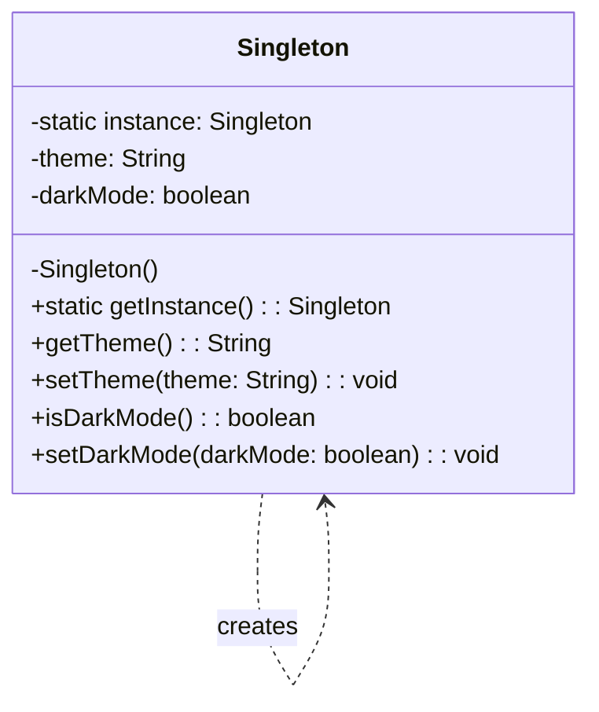

# Singleton Design Pattern

## Intent
Ensure a class only has one instance and provide a global point of access to it.

## What is the Singleton Pattern?

The Singleton pattern restricts the instantiation of a class to a single instance. This is useful when exactly one object is needed to coordinate actions across the system.

Think of it like having only one settings panel in an application - no matter where you access the settings from, you're always working with the same configuration.

## Structure



## Key Elements

1. **Private static instance variable**: Holds the single instance of the class
2. **Private constructor**: Prevents other classes from creating new instances
3. **Public static access method**: Provides global access to the single instance

## Implementation Example: Configuration Manager

This package implements a simple Configuration Manager as a Singleton. It manages application settings that need to be consistent throughout the application:

```java
public class Singleton {
    // The single instance
    private static Singleton instance;
    
    // Configuration values
    private String theme;
    private boolean darkMode;
    
    // Private constructor prevents external instantiation
    private Singleton() {
        theme = "default";
        darkMode = false;
    }
    
    // Public static method provides access to the instance
    public static Singleton getInstance() {
        if (instance == null) {
            instance = new Singleton();
        }
        return instance;
    }
    
    // Configuration getters and setters
    public String getTheme() {
        return theme;
    }
    
    public void setTheme(String theme) {
        this.theme = theme;
    }
    
    public boolean isDarkMode() {
        return darkMode;
    }
    
    public void setDarkMode(boolean darkMode) {
        this.darkMode = darkMode;
    }
}
```

## Real-World Example: Application Settings

Consider an application where multiple components need access to user preferences:

```java
// UI Component accessing configuration
Singleton config = Singleton.getInstance();
config.setTheme("dark-blue");
config.setDarkMode(true);

// Business Logic Component accessing the same configuration
Singleton sameConfig = Singleton.getInstance();
String currentTheme = sameConfig.getTheme(); // Will be "dark-blue"
boolean isDark = sameConfig.isDarkMode();    // Will be true
```

## Benefits of Using Singleton for Configuration

1. **Consistency**: Ensures all parts of the application use the same settings
2. **Global Access**: Easy access to configuration from anywhere
3. **Memory Efficient**: Only one instance of settings exists
4. **Controlled Changes**: All configuration changes are immediately visible everywhere

## When to Use the Singleton Pattern

- When exactly one instance of a class is needed
- When that instance must be accessible from anywhere
- For managing global application state
- For coordinating system-wide actions

## When Not to Use the Singleton Pattern

- When you need multiple instances with different configurations
- When you want to avoid global state
- When you need flexibility in testing
- When different parts of the application need different configurations

## Related Patterns
- **Factory Method**: Can be used to create a singleton
- **Facade**: Often implemented as a singleton
- **Observer**: Subject is often a singleton