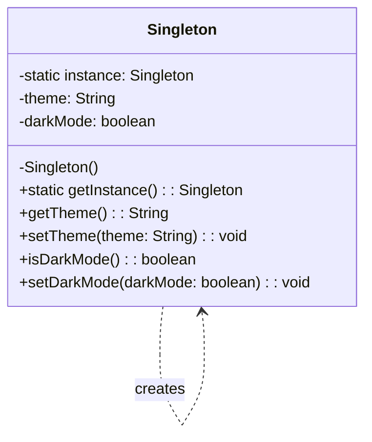

# Singleton Design Pattern

## Intent
Ensure a class only has one instance and provide a global point of access to it.

## What is the Singleton Pattern?

The Singleton pattern restricts the instantiation of a class to a single instance. This is useful when exactly one object is needed to coordinate actions across the system.

Think of it like having only one settings panel in an application - no matter where you access the settings from, you're always working with the same configuration.

## Structure



## Key Elements

1. **Private static instance variable**: Holds the single instance of the class
2. **Private constructor**: Prevents other classes from creating new instances
3. **Public static access method**: Provides global access to the single instance

## Implementation Example: Configuration Manager

This package implements a simple Configuration Manager as a Singleton. It manages application settings that need to be consistent throughout the application:

```java
public class Singleton {
    // The single instance
    private static Singleton instance;
    
    // Configuration values
    private String theme;
    private boolean darkMode;
    
    // Private constructor prevents external instantiation
    private Singleton() {
        theme = "default";
        darkMode = false;
    }
    
    // Public static method provides access to the instance
    public static Singleton getInstance() {
        if (instance == null) {
            instance = new Singleton();
        }
        return instance;
    }
    
    // Configuration getters and setters
    public String getTheme() {
        return theme;
    }
    
    public void setTheme(String theme) {
        this.theme = theme;
    }
    
    public boolean isDarkMode() {
        return darkMode;
    }
    
    public void setDarkMode(boolean darkMode) {
        this.darkMode = darkMode;
    }
}
```

## Real-World Example: Application Settings

Consider an application where multiple components need access to user preferences:

```java
// UI Component accessing configuration
Singleton config = Singleton.getInstance();
config.setTheme("dark-blue");
config.setDarkMode(true);

// Business Logic Component accessing the same configuration
Singleton sameConfig = Singleton.getInstance();
String currentTheme = sameConfig.getTheme(); // Will be "dark-blue"
boolean isDark = sameConfig.isDarkMode();    // Will be true
```

## Benefits of Using Singleton for Configuration

1. **Consistency**: Ensures all parts of the application use the same settings
2. **Global Access**: Easy access to configuration from anywhere
3. **Memory Efficient**: Only one instance of settings exists
4. **Controlled Changes**: All configuration changes are immediately visible everywhere

## When to Use the Singleton Pattern

- When exactly one instance of a class is needed
- When that instance must be accessible from anywhere
- For managing global application state
- For coordinating system-wide actions

## When Not to Use the Singleton Pattern

- When you need multiple instances with different configurations
- When you want to avoid global state
- When you need flexibility in testing
- When different parts of the application need different configurations

## Related Patterns
- **Factory Method**: Can be used to create a singleton
- **Facade**: Often implemented as a singleton
- **Observer**: Subject is often a singleton

## Step-by-Step Code Explanation

Let's break down the implementation of our Configuration Manager Singleton:

### 1. Private Static Instance
```java
private static Singleton instance;
```
Key points:
- Static field holds the single instance
- Private access prevents external modification
- Initially null until first request

### 2. Private Constructor
```java
private Singleton() {
    theme = "default";
    darkMode = false;
}
```
Key points:
- Private constructor prevents `new Singleton()`
- Initializes default configuration values
- Can only be called from within the class

### 3. Public Static Access Method (getInstance)
```java
public static Singleton getInstance() {
    if (instance == null) {
        instance = new Singleton();
    }
    return instance;
}
```
Key points:
- Lazy initialization: instance created only when first needed
- Thread-unsafe version shown for simplicity
- Always returns the same instance

### 4. Thread-Safe Version (Optional Enhancement)
```java
public static synchronized Singleton getInstance() {
    if (instance == null) {
        instance = new Singleton();
    }
    return instance;
}

// Or using double-checked locking
public static Singleton getInstance() {
    if (instance == null) {
        synchronized (Singleton.class) {
            if (instance == null) {
                instance = new Singleton();
            }
        }
    }
    return instance;
}
```
Key points:
- Synchronized keyword ensures thread safety
- Double-checked locking improves performance
- Only synchronizes during first creation

### 5. Configuration Methods
```java
public String getTheme() {
    return theme;
}

public void setTheme(String theme) {
    this.theme = theme;
}

public boolean isDarkMode() {
    return darkMode;
}

public void setDarkMode(boolean darkMode) {
    this.darkMode = darkMode;
}
```
Key points:
- Public methods to access/modify configuration
- Changes affect all parts of application
- Simple getters/setters shown, but can include validation

### 6. Usage Examples
```java
public class SingletonMain {
    public static void main(String[] args) {
        // Get the singleton instance
        Singleton config = Singleton.getInstance();
        
        // Set some configuration
        config.setTheme("dark-blue");
        config.setDarkMode(true);
        
        // Later in another part of the application...
        Singleton sameConfig = Singleton.getInstance();
        System.out.println("Theme: " + sameConfig.getTheme());        // Prints: dark-blue
        System.out.println("Dark Mode: " + sameConfig.isDarkMode());  // Prints: true
        
        // Verify it's the same instance
        System.out.println("Same instance? " + (config == sameConfig));  // Prints: true
    }
}
```
Key points:
- Multiple getInstance() calls return same instance
- Configuration changes are visible everywhere
- Instance equality can be verified with ==

### Common Pitfalls to Avoid
1. **Reflection Breaking Singleton**:
```java
// This can break singleton pattern!
Constructor<Singleton> constructor = Singleton.class.getDeclaredConstructor();
constructor.setAccessible(true);
Singleton instance2 = constructor.newInstance();
```
Solution: Throw exception in constructor if instance exists

2. **Serialization Issues**:
```java
// Add this to prevent multiple instances during deserialization
protected Object readResolve() {
    return getInstance();
}
```

3. **Multiple Class Loaders**:
Each class loader could create its own instance. Use proper class loading strategy.

### Best Practices
1. Consider using an enum for foolproof singleton:
```java
public enum SingletonEnum {
    INSTANCE;
    
    private String theme = "default";
    private boolean darkMode = false;
    
    // Add getters/setters here
}
```

2. Use final class to prevent inheritance:
```java
public final class Singleton {
    // Implementation
}
```

3. Consider dependency injection instead of singleton when possible
4. Ensure thread safety in multi-threaded applications