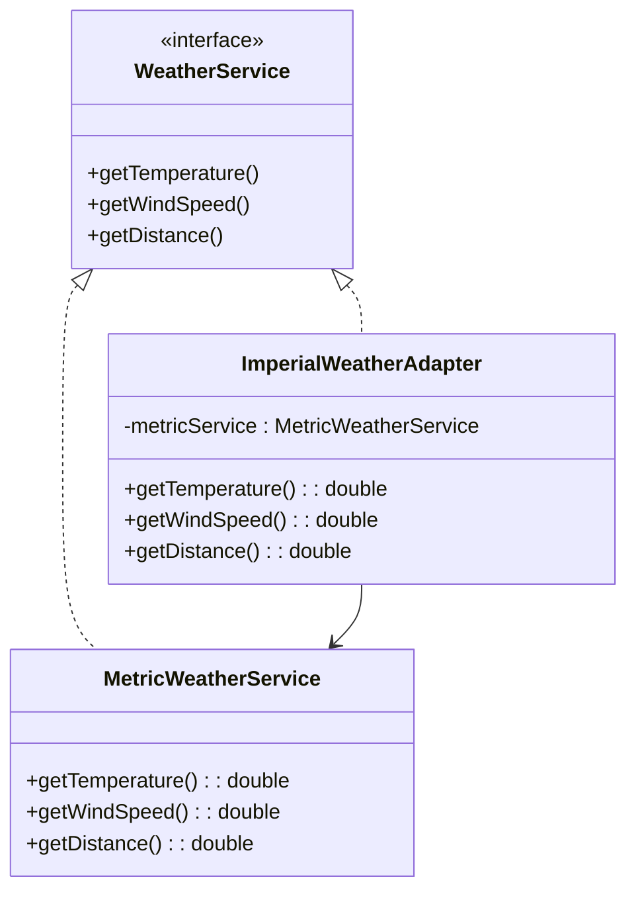

# Adapter Pattern

## What problem does the Adapter pattern solve?
The Adapter pattern helps objects with incompatible interfaces work together. It acts as a bridge between two incompatible interfaces by wrapping an object in an adapter to make it compatible with another class. This is similar to how a power adapter allows you to use an electrical device in a foreign country with different power outlets.

## A simple real world example
Think of a card reader that connects your camera's memory card to a laptop's USB port. The memory card and USB port have different interfaces, but the card reader (adapter) allows them to work together.

## Use Case
In our example, we have two weather services:
- One service uses metric units (Celsius, kilometers, etc.)
- Another service uses imperial units (Fahrenheit, miles, etc.)

Instead of modifying either service, we create an adapter that converts between these measurement systems, allowing our application to work with both services seamlessly.

## Key Characteristics
1. **Interface Translation**: Converts one interface into another
2. **Encapsulation**: The client is unaware of the adaptation process
3. **Reusability**: Allows reuse of existing code with incompatible interfaces
4. **Single Responsibility**: The adapter is responsible only for interface conversion
5. **Loose Coupling**: Client code remains independent of the specific implementation

## Class Diagram



## Step-by-Step Code Explanation

Let's walk through each file in our implementation and understand what each piece does:

### 1. WeatherService.java (The Interface)
```java
public interface WeatherService {
    double getTemperature();
    double getWindSpeed();
    double getDistance();
}
```
This interface defines the contract that both our original service and adapter must follow:
- `getTemperature()`: Gets the temperature measurement
- `getWindSpeed()`: Gets the wind speed measurement
- `getDistance()`: Gets the distance measurement

### 2. MetricWeatherService.java (The Original Service)
```java
public class MetricWeatherService implements WeatherService {
    @Override
    public double getTemperature() {
        return 25.0;  // 25°C
    }

    @Override
    public double getWindSpeed() {
        return 15.0;  // 15 km/h
    }

    @Override
    public double getDistance() {
        return 100.0;  // 100 km
    }
}
```
This is our original service that works with metric units:
- Returns temperature in Celsius
- Returns wind speed in kilometers per hour
- Returns distance in kilometers
- For simplicity, we're using hardcoded values (in a real application, these would come from actual sensors or APIs)

### 3. ImperialWeatherAdapter.java (The Adapter)
```java
public class ImperialWeatherAdapter implements WeatherService {
    private MetricWeatherService metricService;

    public ImperialWeatherAdapter(MetricWeatherService metricService) {
        this.metricService = metricService;
    }

    @Override
    public double getTemperature() {
        double celsius = metricService.getTemperature();
        return (celsius * 9/5) + 32;  // Convert to Fahrenheit
    }

    @Override
    public double getWindSpeed() {
        double kmh = metricService.getWindSpeed();
        return kmh * 0.621371;  // Convert to mph
    }

    @Override
    public double getDistance() {
        double km = metricService.getDistance();
        return km * 0.621371;  // Convert to miles
    }
}
```
This is our adapter class that:
1. Takes a MetricWeatherService in its constructor
2. Implements the WeatherService interface
3. Converts each metric measurement to its imperial equivalent:
   - Celsius → Fahrenheit: (°C × 9/5) + 32
   - Kilometers per hour → Miles per hour: km/h × 0.621371
   - Kilometers → Miles: km × 0.621371

### 4. AdapterMain.java (The Demo)
```java
public class AdapterMain {
    public static void main(String[] args) {
        // Create the original metric service
        MetricWeatherService metricService = new MetricWeatherService();
        
        // Create the adapter wrapping the metric service
        ImperialWeatherAdapter imperialAdapter = 
            new ImperialWeatherAdapter(metricService);

        // Display both metric and imperial measurements
        System.out.println("Metric Weather Service:");
        System.out.printf("Temperature: %.1f°C%n", 
            metricService.getTemperature());
        System.out.printf("Wind Speed: %.1f km/h%n", 
            metricService.getWindSpeed());
        System.out.printf("Distance: %.1f km%n", 
            metricService.getDistance());

        System.out.println("\nImperial Weather Service (through adapter):");
        System.out.printf("Temperature: %.1f°F%n", 
            imperialAdapter.getTemperature());
        System.out.printf("Wind Speed: %.1f mph%n", 
            imperialAdapter.getWindSpeed());
        System.out.printf("Distance: %.1f miles%n", 
            imperialAdapter.getDistance());
    }
}
```
The demo class shows how to:
1. Create an instance of the original metric service
2. Create an adapter that wraps the metric service
3. Use both services to display weather data in both unit systems
4. The client code works with both services through the same interface

### Sample Output
```
Metric Weather Service:
Temperature: 25.0°C
Wind Speed: 15.0 km/h
Distance: 100.0 km

Imperial Weather Service (through adapter):
Temperature: 77.0°F
Wind Speed: 9.3 mph
Distance: 62.1 miles
```

This implementation demonstrates how the Adapter pattern:
- Makes incompatible interfaces work together
- Keeps the conversion logic in one place
- Allows for easy addition of new conversion types
- Maintains clean, readable, and maintainable code