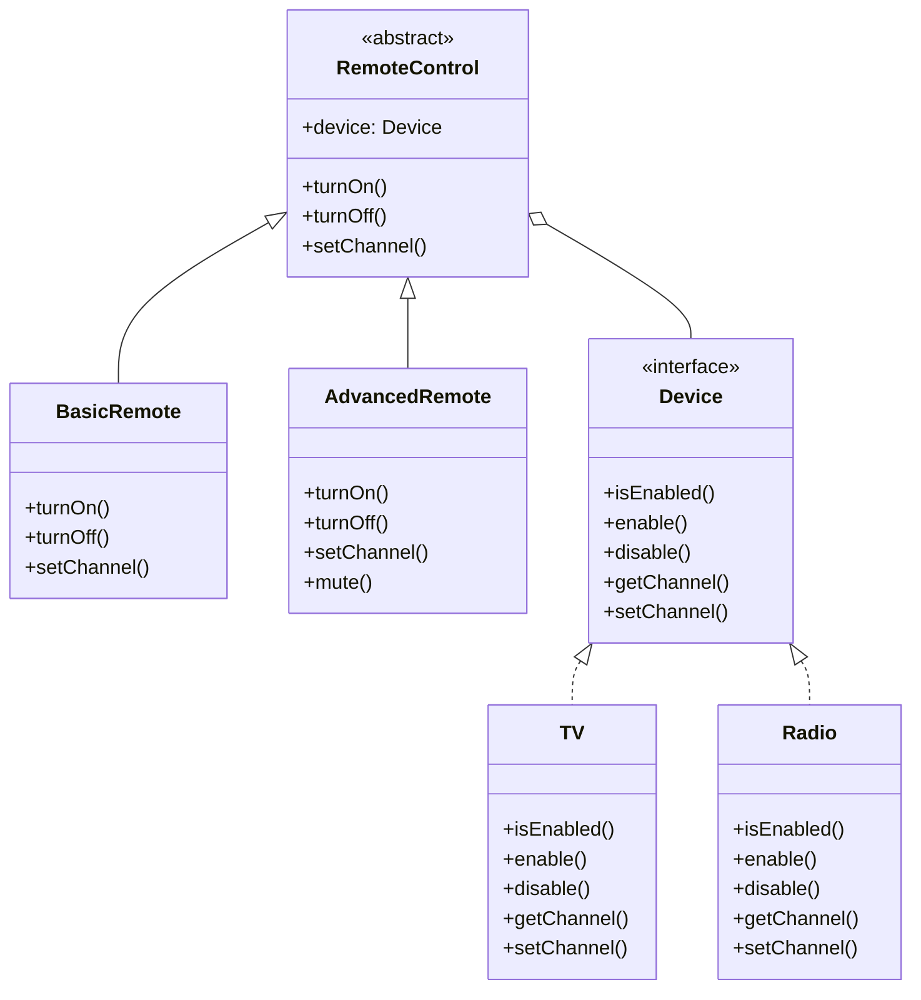

# Bridge Design Pattern

## What problem does that design pattern solve?
The Bridge pattern solves the problem of having a growing number of class combinations when we need to extend a class in two independent dimensions. It helps avoid a proliferation of classes by separating an abstraction from its implementation, allowing them to vary independently.

## A simple real world example of that pattern in action
Consider a remote control system for different devices (TV, Radio). Without the Bridge pattern, we would need separate remote classes for each device type (TVRemote, RadioRemote) and each feature set (BasicRemote, AdvancedRemote), leading to many combinations. The Bridge pattern allows us to separate the remote types from the devices they control, making the system more flexible and maintainable.

## Use Case
- When you want to avoid a permanent binding between an abstraction and its implementation
- When both the abstractions and their implementations should be extensible through subclassing
- When changes in the implementation should not impact the abstraction's clients
- When you want to share an implementation among multiple objects

## Key Characteristics
1. Separation of concerns: Separates abstraction from implementation
2. Enhanced extensibility: Both abstraction and implementation can be extended independently
3. Implementation hiding: Client code only deals with the abstraction
4. Loose coupling: Abstractions and implementations are loosely coupled

## Class Diagram


## Step-by-Step Code Explanation

1. **Device Interface (Device.java)**
   - Defines the contract for all devices (TV, Radio)
   - Contains basic device operations like enable/disable, volume/channel control
   - This is the "Implementation" part of the bridge
   ```java
   public interface Device {
       boolean isEnabled();
       void enable();
       void disable();
       int getChannel();
       void setChannel(int channel);
       int getVolume();
       void setVolume(int volume);
   }
   ```

2. **Concrete Devices (TV.java, Radio.java)**
   - Implement the Device interface with specific behavior
   - TV uses channels 1-999
   - Radio uses FM frequencies (87-108 MHz)
   - Both maintain their own state (on/off, volume, channel)
   ```java
   public class TV implements Device {
       private boolean on = false;
       private int volume = 30;
       private int channel = 1;

       @Override
       public void enable() {
           on = true;
       }

       @Override
       public void setChannel(int channel) {
           this.channel = channel;
       }
       // ...other implementations
   }

   public class Radio implements Device {
       private boolean on = false;
       private int volume = 20;
       private int channel = 87;  // FM frequency

       @Override
       public void setChannel(int channel) {
           // FM frequency range: 87.5 - 108.0 MHz
           if (channel >= 87 && channel <= 108) {
               this.channel = channel;
           }
       }
       // ...other implementations
   }
   ```

3. **Remote Control Abstraction (RemoteControl.java)**
   - Abstract class that holds a reference to a Device
   - Provides basic operations that work with any device
   - Acts as a bridge between the remote types and device implementations
   - This is the "Abstraction" part of the bridge
   ```java
   public abstract class RemoteControl {
       protected Device device;

       public RemoteControl(Device device) {
           this.device = device;
       }

       public void turnOn() {
           device.enable();
       }

       public void setChannel(int channel) {
           device.setChannel(channel);
       }
       // ...other operations
   }
   ```

4. **Basic Remote (BasicRemote.java)**
   - Extends RemoteControl with basic functionality
   - Provides simple operations: channel up/down, volume up/down
   - Works with any device that implements the Device interface
   ```java
   public class BasicRemote extends RemoteControl {
       public BasicRemote(Device device) {
           super(device);
       }

       public void channelUp() {
           setChannel(device.getChannel() + 1);
       }

       public void volumeUp() {
           setVolume(device.getVolume() + 10);
       }
       // ...other operations
   }
   ```

5. **Advanced Remote (AdvancedRemote.java)**
   - Extends BasicRemote with additional features
   - Adds mute functionality and favorite channel saving
   - Shows how we can extend the abstraction independently
   ```java
   public class AdvancedRemote extends BasicRemote {
       public AdvancedRemote(Device device) {
           super(device);
       }

       public void mute() {
           device.setVolume(0);
       }

       public void saveChannel(int channelNumber) {
           System.out.println("Saved channel " + channelNumber + " as favorite");
           setChannel(channelNumber);
       }
   }
   ```

6. **Usage Example (BridgeMain.java)**
   ```java
   public class BridgeMain {
       public static void main(String[] args) {
           // Create a TV device
           Device tv = new TV();
           
           // Create remotes for TV
           BasicRemote basicTvRemote = new BasicRemote(tv);
           AdvancedRemote advancedTvRemote = new AdvancedRemote(tv);

           // Use basic remote
           basicTvRemote.turnOn();
           basicTvRemote.setChannel(5);
           
           // Use advanced remote
           advancedTvRemote.mute();
           advancedTvRemote.saveChannel(7);

           // Similarly with Radio
           Device radio = new Radio();
           BasicRemote basicRadioRemote = new BasicRemote(radio);
           // ... use the remote with radio
       }
   }
   ```

Here's how it all works together:
1. Create a device (TV or Radio)
2. Create a remote control (Basic or Advanced) and pass the device to it
3. Use the remote control to operate the device
4. The remote control (Abstraction) delegates the actual operations to the device (Implementation)

This separation allows us to:
- Add new types of devices without changing the remotes
- Add new types of remotes without changing the devices
- Mix and match any remote with any device