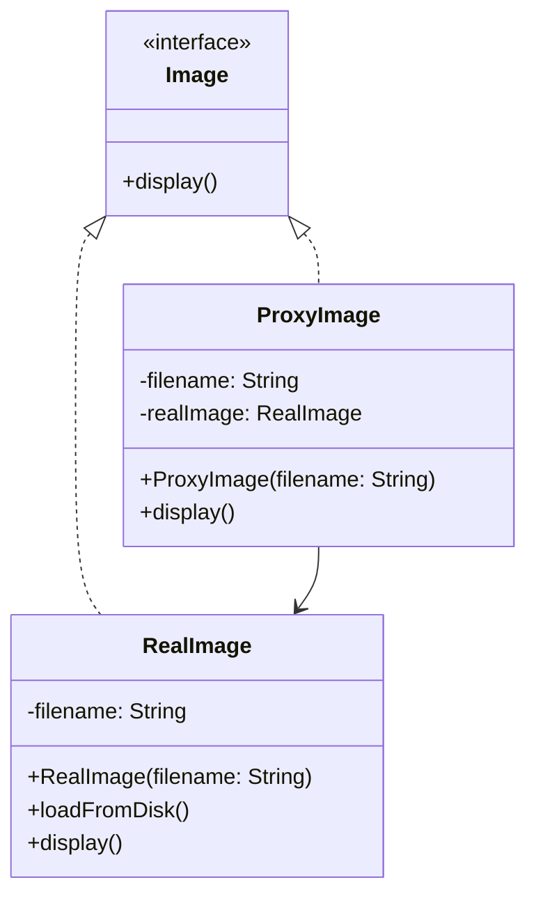

# Proxy Design Pattern

## What problem does that design pattern solve?
The Proxy pattern provides a surrogate or placeholder for another object to control access to it. It's useful when you want to add a layer between the client and the actual object, which can be used for:
- Lazy initialization (virtual proxy)
- Access control (protection proxy)
- Logging/monitoring (logging proxy)
- Caching results (caching proxy)

## A simple real world example
Think of a debit card as a proxy for your bank account. Instead of carrying cash (the real object), you use the debit card (the proxy) to access your money. The debit card acts as an intermediary that provides additional security and convenience.

## Use Case
We'll implement a simple example of an expensive image loading system. Instead of loading a high-resolution image immediately (which could be slow and memory-intensive), we'll use a proxy that:
1. Shows a loading message first
2. Loads the actual image only when it's really needed
3. Caches the result for future use

## Key Characteristics
1. The Proxy and RealSubject implement the same interface
2. The Proxy maintains a reference to the RealSubject
3. The Proxy controls access to the RealSubject
4. The Proxy can add additional behavior before/after accessing the RealSubject

## Class Diagram


This pattern is particularly useful when you need to control access to an object, especially when direct access to that object is not desirable or possible.

## Step-by-Step Code Explanation

Let's break down the implementation of our Image Loading Proxy system:

### 1. The Subject Interface (Image.java)
```java
public interface Image {
    void display();
}
```
Key points:
- Simple interface that both real object and proxy will implement
- Single method for demonstration purposes
- Clients will work with this interface

### 2. The Real Subject (RealImage.java)
```java
public class RealImage implements Image {
    private String filename;

    public RealImage(String filename) {
        this.filename = filename;
        loadFromDisk(); // Heavy operation
    }

    private void loadFromDisk() {
        System.out.println("Loading " + filename + " from disk");
        // Simulate heavy image loading
        try {
            Thread.sleep(1000);
        } catch (InterruptedException e) {
            e.printStackTrace();
        }
    }

    @Override
    public void display() {
        System.out.println("Displaying " + filename);
    }
}
```
Key points:
- Does the actual heavy work (loading image)
- Simulates time-consuming operations
- Called only when actually needed

### 3. The Proxy (ProxyImage.java)
```java
public class ProxyImage implements Image {
    private String filename;
    private RealImage realImage;  // Reference to real object

    public ProxyImage(String filename) {
        this.filename = filename;
        // Note: RealImage is not created here
    }

    @Override
    public void display() {
        if (realImage == null) {
            System.out.println("Loading image first time...");
            realImage = new RealImage(filename);  // Lazy initialization
        }
        realImage.display();  // Delegate to real object
    }
}
```
Key points:
- Implements same interface as RealImage
- Holds reference to RealImage but doesn't create it immediately
- Creates RealImage only when needed (lazy loading)
- Acts as a surrogate controlling access to RealImage

### 4. Using the Proxy (ProxyMain.java)
```java
public class ProxyMain {
    public static void main(String[] args) {
        // Using the proxy
        Image image = new ProxyImage("photo.jpg");

        // Image will be loaded from disk
        System.out.println("First time display:");
        image.display();

        // Image will NOT be loaded from disk
        System.out.println("\nSecond time display:");
        image.display();
    }
}
```
Output:
```
First time display:
Loading image first time...
Loading photo.jpg from disk
Displaying photo.jpg

Second time display:
Displaying photo.jpg
```
Key points:
- Client works with Image interface
- Doesn't know if it's using real image or proxy
- First call loads image, subsequent calls use cached instance

### Common Variations

1. **Protection Proxy**:
```java
public class ProtectionProxyImage implements Image {
    private String filename;
    private RealImage realImage;
    private String userRole;

    public ProtectionProxyImage(String filename, String userRole) {
        this.filename = filename;
        this.userRole = userRole;
    }

    @Override
    public void display() {
        if (userRole.equals("ADMIN")) {
            if (realImage == null) {
                realImage = new RealImage(filename);
            }
            realImage.display();
        } else {
            System.out.println("Access denied");
        }
    }
}
```

2. **Logging Proxy**:
```java
public class LoggingProxyImage implements Image {
    private RealImage realImage;
    private String filename;

    public LoggingProxyImage(String filename) {
        this.filename = filename;
    }

    @Override
    public void display() {
        System.out.println("Logging: Attempt to display " + filename);
        if (realImage == null) {
            realImage = new RealImage(filename);
        }
        realImage.display();
        System.out.println("Logging: Finished displaying " + filename);
    }
}
```

### Best Practices
1. Keep the proxy as lightweight as possible
2. Only create the real object when necessary
3. Consider using different proxy types for different concerns
4. Use the same interface as the real object
5. Consider combining proxy types if needed (e.g., logging + caching)