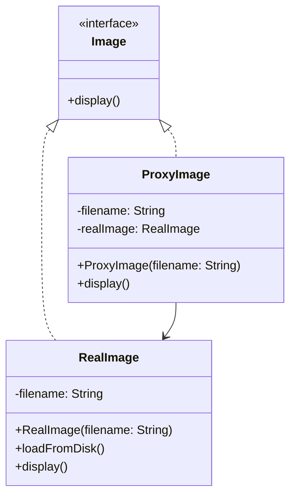

# Proxy Design Pattern

## What problem does that design pattern solve?
The Proxy pattern provides a surrogate or placeholder for another object to control access to it. It's useful when you want to add a layer between the client and the actual object, which can be used for:
- Lazy initialization (virtual proxy)
- Access control (protection proxy)
- Logging/monitoring (logging proxy)
- Caching results (caching proxy)

## A simple real world example
Think of a debit card as a proxy for your bank account. Instead of carrying cash (the real object), you use the debit card (the proxy) to access your money. The debit card acts as an intermediary that provides additional security and convenience.

## Use Case
We'll implement a simple example of an expensive image loading system. Instead of loading a high-resolution image immediately (which could be slow and memory-intensive), we'll use a proxy that:
1. Shows a loading message first
2. Loads the actual image only when it's really needed
3. Caches the result for future use

## Key Characteristics
1. The Proxy and RealSubject implement the same interface
2. The Proxy maintains a reference to the RealSubject
3. The Proxy controls access to the RealSubject
4. The Proxy can add additional behavior before/after accessing the RealSubject

## Class Diagram

This pattern is particularly useful when you need to control access to an object, especially when direct access to that object is not desirable or possible.